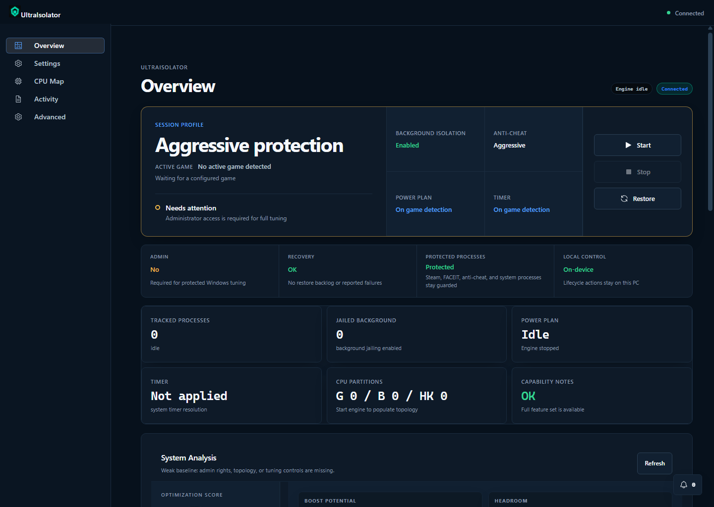
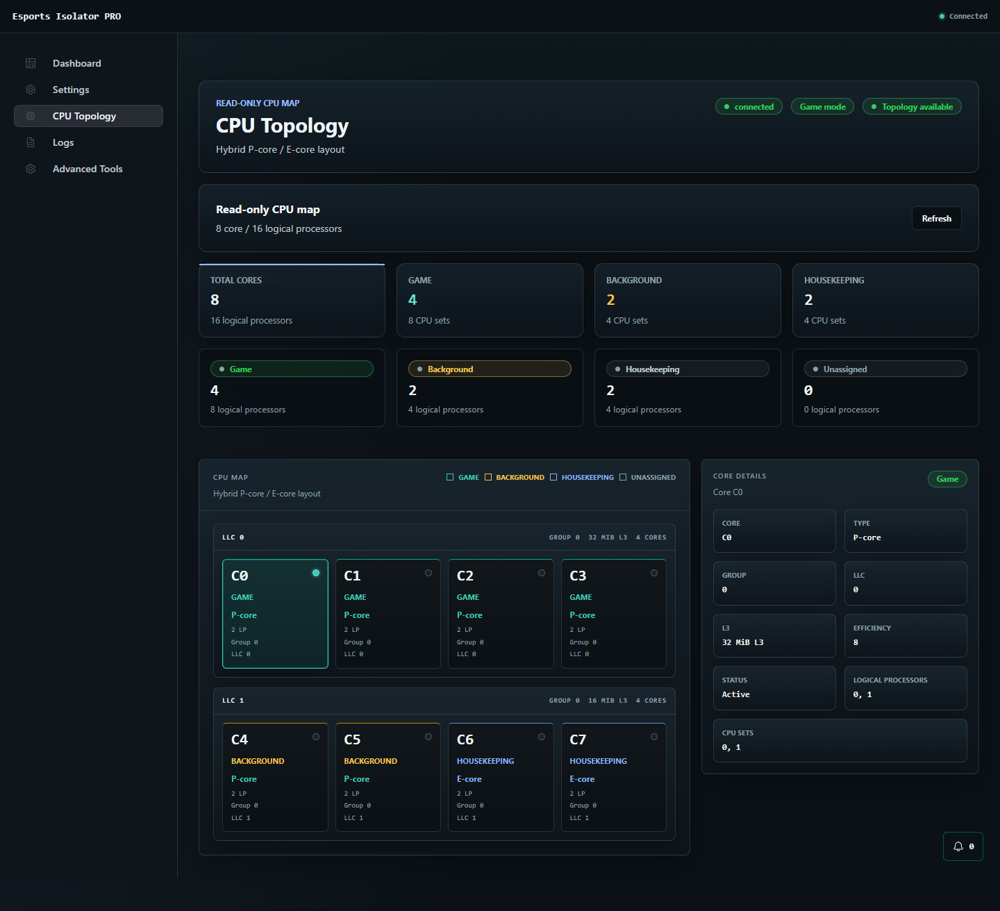
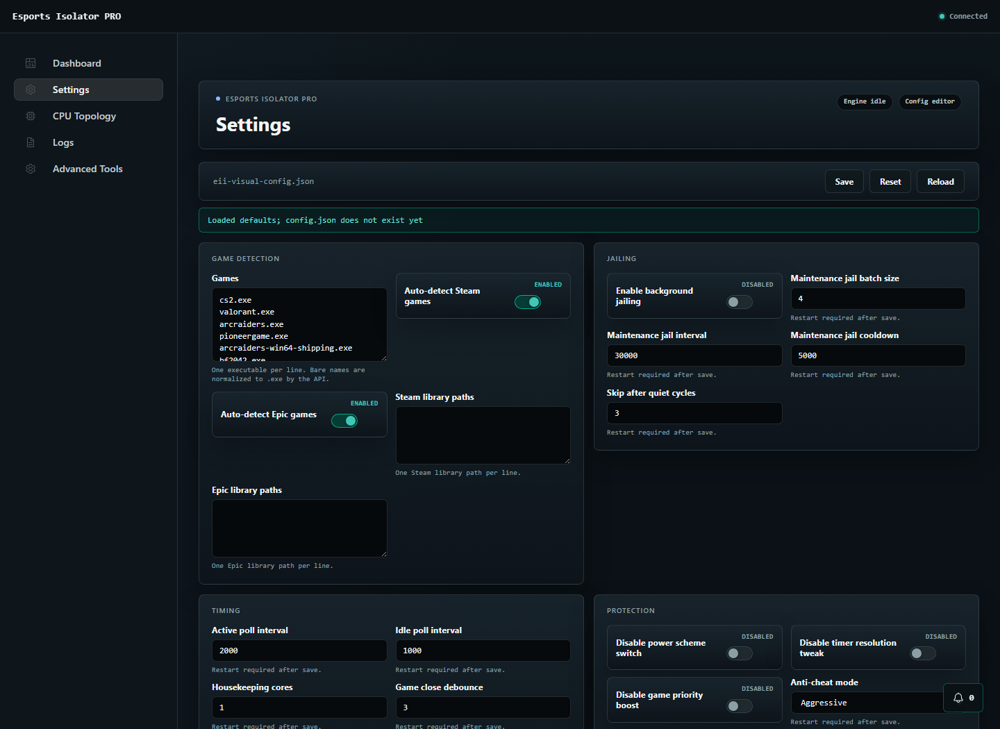

<p align="center">
  <a href="https://github.com/chezzof/ultraisolator">
    
  </a>
</p>

<h1 align="center">Esports Isolator PRO</h1>

<p align="center">
  <strong>Windows process isolation and frame-time stability tooling for competitive games.</strong>
</p>

<p align="center">
  <a href="https://github.com/chezzof/ultraisolator/actions/workflows/tests.yml"></a>
  <a href="https://github.com/chezzof/ultraisolator/releases"></a>
  <a href="https://www.python.org/"></a>
  <a href="ui"></a>
  
  <a href="LICENSE"></a>
</p>

<p align="center">
  <a href="#quick-start"><strong>Quick Start</strong></a>
  &nbsp;|&nbsp;
  <a href="https://github.com/chezzof/ultraisolator/releases"><strong>Releases</strong></a>
  &nbsp;|&nbsp;
  <a href="benchmark-results-hud.html"><strong>Benchmark Report</strong></a>
  &nbsp;|&nbsp;
  <a href="docs/security-hardening-audit.md"><strong>Security Audit</strong></a>
  &nbsp;|&nbsp;
  <a href="docs/codex-for-oss-submission.md"><strong>Codex for OSS</strong></a>
</p>

Esports Isolator PRO detects a running game, reserves cleaner CPU capacity for it, moves background work out of the way, applies low-latency Windows tuning, and restores the machine when the session ends. It is built for players, benchmarkers, and open-source reviewers who care about frame-time stability rather than only headline FPS.

| What a reviewer can verify | Evidence in this repository |
|----------------------------|-----------------------------|
| **Release readiness** | `scripts/release-check.ps1` runs Python tests, config dry-run, npm audit, renderer build, backend manifest generation, smoke test, visual/accessibility quality checks, package build, packaged runtime provenance checks, and checksum generation. |
| **Measured performance** | CS2 VProf benchmark shows avg FPS +9.8%, P95 spike -26.0%, client rendering spike -48.0%, and HUD spike -87.6%; source summary lives in `docs/benchmarks/cs2-vprof-summary.json`. |
| **Safety boundary** | Windows-only, Administrator-scoped, anti-cheat-aware, protected process list, opt-in background jailing, and crash recovery. |
| **OSS hygiene** | CI, issue templates, PR template, security policy, release checklist, reproducible build docs, and public submission notes. |

<p align="center">
  
</p>

## Why It Matters

Competitive games are sensitive to short bursts of background scheduling noise. Browser helpers, launchers, updaters, overlays, terminals, capture tools, and desktop services can all compete for CPU time at the wrong moment. Esports Isolator PRO gives Windows a stricter layout during play:

- Game processes receive foreground priority and dedicated CPU-set placement.
- Background jailing is opt-in, batched, reversible, and crash-recoverable.
- Power plan switching is automatic and restores the user's original plan.
- Anti-cheat-sensitive processes, Steam, FACEIT, terminals, and system processes are protected.
- The desktop app uses a hardened localhost bridge with a per-launch bearer token.

## Benchmark Result

Measured with Counter-Strike 2 VProf telemetry. Full local report: [`benchmark-results-hud.html`](benchmark-results-hud.html). Structured source summary: [`docs/benchmarks/cs2-vprof-summary.json`](docs/benchmarks/cs2-vprof-summary.json).

| Metric | Without | With Isolator | Change |
|--------|---------|---------------|--------|
| Avg FPS | 564.5 | 619.7 | **+9.8%** |
| 1% Low FPS | 204.1 | 207.1 | +1.5% |
| Avg Frame Time | 1.77 ms | 1.61 ms | **-9.0%** |
| P95 Spike, worst 1s | 8.87 ms | 6.56 ms | **-26.0%** |
| Client Rendering spike | 5.29 ms | 2.75 ms | **-48.0%** |
| HUD spike | 3.88 ms | 0.48 ms | **-87.6%** |

Run context: 126 background processes jailed, 10 cores reserved for game work, 4 for background work, 2 for housekeeping, High Performance power plan activated, and 125/125 tracked processes restored with 0 failures after exit.

## Screenshots

<table>
  <tr>
    <td width="50%">
      
    </td>
    <td width="50%">
      
    </td>
  </tr>
  <tr>
    <td><strong>Topology</strong><br>CPU groups, game cores, background cores, housekeeping capacity, and live partition status.</td>
    <td><strong>Settings</strong><br>Config presets, app profiles, protected process controls, and anti-cheat-aware tuning options.</td>
  </tr>
</table>

## Safety Model

This project intentionally touches sensitive Windows controls. Read this before running it:

- Windows 10/11 only.
- Administrator is required for full CPU Sets, IFEO, power plan, timer, and process tuning behavior.
- `enable_background_jailing` defaults to `false`; turn it on only after reading the config.
- Packaged desktop builds do not trust arbitrary inherited `EII_PYTHON` values in production. The packaged launcher accepts only an existing absolute interpreter path under an allowlisted protected install root, and fails closed if no bundled or protected interpreter is available.
- Packaged desktop builds verify the backend resource integrity manifest before launch. The manifest lives in the trusted app bundle and checks files copied to `resources/backend`.
- Packaged startup fails closed before Python is spawned if the interpreter path or `resources/backend` is standard-user writable, if backend hashes do not match, or if an executable/source backend file is missing from the manifest.
- Use `anti_cheat_mode: "conservative"` for games with stricter anti-cheat stacks.
- The tool does not download or execute remote code at runtime.
- The localhost desktop API is protected by a per-launch bearer token kept in Electron main; renderer requests use allowlisted IPC proxy operations and never receive the raw token.
- IFEO and power recovery state is stored under protected app data, signed with a local integrity tag, ACL-checked before restore, and rejected fail-closed if tampered.
- Local logs/config/recovery files can contain process names and local paths; do not paste them publicly without review.

## Quick Start

```powershell
git clone https://github.com/chezzof/ultraisolator.git
cd ultraisolator
python -m pip install -r requirements.txt
copy config.json.example config.json
python best_isolator.py --dry-run
python best_isolator.py
```

Run PowerShell or Windows Terminal as Administrator for full tuning.

## Desktop UI

The Electron app is a thin shell over the same Python engine. It opens a local API bridge, keeps the backend alive while the window is closed to tray, and pauses expensive UI reads during game mode.

```powershell
python -m pip install -r requirements.txt
npm --prefix ui install
npm --prefix ui run dev
```

Useful UI checks:

```powershell
npm --prefix ui run build:renderer
npm --prefix ui run build:assets
npm --prefix ui run build:backend-manifest
npm --prefix ui run smoke
```

Production packaging is documented in [BUILDING.md](BUILDING.md).

## Release

No public GitHub release has been published for `chezzof/ultraisolator` yet.

Until the first public release is cut, build artifacts locally with the release gate:

```powershell
powershell -File scripts/release-check.ps1
```

That gate creates local NSIS installer and portable artifacts under `ui/dist-packaged`, writes `SHA256SUMS.txt`, and checks the packaged runtime provenance. Checksums detect artifact corruption but do not authenticate publisher provenance without signed checksums or attestations. Release notes must document the Windows-only scope, unsigned installer caveat, trusted Python requirement, Administrator requirement, anti-cheat boundary, and opt-in background jailing model before any artifacts are published.

## Configuration

Copy [`config.json.example`](config.json.example) to `config.json` and edit.

| Key | Default | Description |
|-----|---------|-------------|
| `games` | `["cs2.exe"]` | Process names to detect as games |
| `auto_detect_steam_games` | `true` | Scan Steam libraries for installed games |
| `auto_detect_epic_games` | `true` | Scan Epic Games libraries |
| `enable_background_jailing` | `false` | Jail background processes using CPU sets, idle priority, and I/O throttling |
| `disable_power_scheme_switch` | `false` | Leave the user's current power plan untouched when `true` |
| `disable_game_priority_boost` | `false` | Skip runtime priority changes and startup IFEO for configured games |
| `disable_timer_resolution_tweak` | `false` | Skip `NtSetTimerResolution` |
| `anti_cheat_mode` | `"aggressive"` | Use `"conservative"` for stricter anti-cheat environments |
| `game_close_debounce_s` | `3` | Seconds to wait before confirming game exit |
| `game_exit_restore_delay_s` | `10` | Seconds after all game PIDs are gone before restore |
| `protected_extra` | `[]` | Additional process names that must never be jailed |
| `app_profiles` | `[]` | Per-app overrides for detection, jailing, and priority |
| `poll_interval_active_ms` | `2000` | Monitor interval during game; 5000 is recommended for CS2 frametime testing |

## CLI

```powershell
python best_isolator.py
python best_isolator.py --config myconfig.json
python best_isolator.py --dry-run
python best_isolator.py --recover
python best_isolator.py --log-file session.log
python best_isolator.py --benchmark --benchmark-duration-sec 30
```

## Architecture

```text
best_isolator.py
  -> isolator.app.EsportsIsolatorPro
     -> discovery: Steam/Epic/config game detection
     -> topology: CPU core grouping and partitions
     -> tuning: CPU sets, priority, I/O throttling, restore
     -> ifeo_power: IFEO startup hints and power plan switching
     -> recovery: crash-safe jail-state restore
     -> runtime: monitor loop, foreground tracking, clean shutdown

server/
  -> localhost API bridge for the Electron renderer

ui/
  -> Electron shell, React renderer, Carbon components, tray integration
```

## Verification

```powershell
python -m unittest discover -s tests -p "test_*.py" -v
npm --prefix ui run build:renderer
npm --prefix ui run build:assets
npm --prefix ui run build:backend-manifest
npm --prefix ui run smoke
```

Optional full package build:

```powershell
npm --prefix ui run build
npm --prefix ui run verify:packaged-runtime
```

Release gate:

```powershell
powershell -File scripts/release-check.ps1
```

CI runs the Python suite on Windows and verifies the desktop renderer/smoke surface. Release hypotheses and go/no-go criteria are tracked in [docs/release-readiness.md](docs/release-readiness.md). Use [docs/release-notes-template.md](docs/release-notes-template.md) when publishing artifacts; it includes the required checksum and unsigned-installer notes.

## Log Verification

```powershell
python best_isolator.py --log-file isolator-run.log
# Play CS2 for 15-20 minutes, then Ctrl+C.
```

Healthy session checks:

| Check | Expected |
|-------|----------|
| Game detected | `[GAME] Optimized running game: cs2.exe` |
| No false close | No `[GAME] Game closed` while the game is running |
| Clean shutdown | Shutdown steps complete and `All state restored` appears |
| CS2 VAC note | `VAC/anti-cheat blocked ... restore` can be expected and is not automatically a failure |

```powershell
Select-String -Path isolator-run.log -Pattern "Game closed|RESTORE|SHUTDOWN|Throttled 0 new"
```

## Codex for OSS Application Notes

This repository is a good fit for an open-source assistance workflow because it combines Windows API work, a local Python service, an Electron/React desktop app, benchmark validation, and safety-sensitive review constraints. Codex was used to help harden the public surface: documentation, UI polish, reproducible verification, CI coverage, contribution hygiene, and security boundaries.

Suggested application narrative:

- Problem: competitive games suffer from background scheduling noise and inconsistent frame times.
- Solution: reversible Windows process isolation with protected anti-cheat/system paths.
- Evidence: CS2 VProf benchmark report, tests, screenshots, visual/accessibility checks, release artifacts, and local smoke checks.
- OSS value: transparent implementation, reproducible local build, issue/PR templates, and documented safety boundaries.

See [docs/codex-for-oss-submission.md](docs/codex-for-oss-submission.md) for the submission copy and evidence trail, and [docs/oss-launch-checklist.md](docs/oss-launch-checklist.md) for ethical outreach and repository launch steps.

## Contributing

Contributions are welcome when they are testable and anti-cheat-aware. Start with [CONTRIBUTING.md](CONTRIBUTING.md), include Windows/Python/game context in bug reports, and run the verification commands above before opening a PR.

## Security

Report vulnerabilities privately through [GitHub Security Advisories](https://github.com/chezzof/ultraisolator/security/advisories/new). See [SECURITY.md](SECURITY.md).

## License

[MIT](LICENSE)
