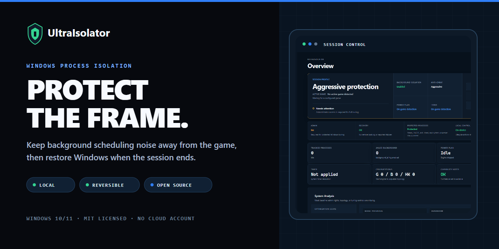

<p align="center">
  <a href="#install-on-windows">
    
  </a>
</p>

<h1 align="center">UltraIsolator</h1>

<p align="center">
  <strong>Protect the frame.</strong><br>
  A local, reversible Windows process tuner that keeps background scheduling noise away from the game, then returns Windows to its previous state when the session ends.
</p>

<p align="center">
  <a href="https://github.com/chezzof/ultraisolator/actions/workflows/tests.yml"></a>
  <a href="https://github.com/chezzof/ultraisolator/releases/latest"></a>
  
  <a href="LICENSE"></a>
</p>

<p align="center">
  <a href="#install-on-windows"><strong>Install on Windows</strong></a>
  &nbsp;&nbsp;·&nbsp;&nbsp;
  <a href="#how-it-works">How it works</a>
  &nbsp;&nbsp;·&nbsp;&nbsp;
  <a href="#measured-on-cs2">Measured results</a>
  &nbsp;&nbsp;·&nbsp;&nbsp;
  <a href="#safety-first">Safety</a>
</p>

UltraIsolator watches for configured games, prepares a clean CPU layout, and applies only the tuning selected for the current session. Game detection is independent from process-tuning success, so anti-cheat access restrictions do not make an active game disappear from the interface.

Windows 10/11 · Administrator access required · Local by design · MIT licensed

## How It Works

| 01 — Detect | 02 — Review |
|---|---|
| Watches configured games and scans Steam and Epic libraries. | Checks administrator access, CPU topology, configured games, and safe-restore readiness. |

| 03 — Isolate | 04 — Restore |
|---|---|
| Applies the selected CPU, process, timer, and power tuning for the active session. | Returns tracked Windows state when the game closes or you restore manually. |

Monitoring starts automatically whenever the desktop app launches. A manual pause lasts only for that app session; the next launch resumes monitoring.

## Why UltraIsolator

- **Game-aware:** detection follows the game process before tuning, including access-denied and conservative anti-cheat paths.
- **Local:** the desktop UI talks only to an authenticated loopback API. No cloud account is required.
- **Protected:** Windows, Steam, FACEIT, anti-cheat, terminals, and configured protected processes stay outside background isolation.
- **Reversible:** process state, timer resolution, IFEO hints, and the original power plan are restored after the session.

Background isolation is optional and defaults to off. When enabled, it is batched to avoid turning maintenance work into a new source of frame-time noise.

## Safety First

UltraIsolator changes sensitive Windows scheduling controls. Read these boundaries before installation:

- Windows 10/11 only. Mutating desktop, CLI, benchmark, and recovery paths require Administrator elevation and fail closed without it; `--dry-run` remains available to standard users.
- The production desktop package is NSIS-only and installs per-machine under `Program Files`. The installer currently appears as **Esports Isolator PRO** to preserve the existing Windows package identity.
- End users do not install Python separately. The package includes a private Python 3.12 runtime and `psutil`.
- Packaged startup verifies a backend resource integrity manifest stored in the trusted app bundle before launching code from `resources/backend`.
- Startup fails closed if the Python runtime, backend, or manifest is standard-user writable, missing, or does not match the signed build manifest.
- Production ignores arbitrary inherited Python paths. `EII_ALLOW_UNTRUSTED_PACKAGED_PYTHON` is restricted to non-production developer diagnostics.
- Use `anti_cheat_mode: "conservative"` for stricter anti-cheat stacks. UltraIsolator does not inject into game or anti-cheat processes.
- The application does not download or execute remote code at runtime.

Local logs and recovery files can contain process names and local paths. Review them before sharing.

## Measured on CS2

The repository includes a Counter-Strike 2 VProf comparison of the same workload with and without the isolator. The strongest result was lower high-percentile frame-time spikes, not a promise of universal FPS gain.

| VProf metric | Without | With UltraIsolator | Change |
|---|---:|---:|---:|
| FrameTotal P95 spike | 8.87 ms | 6.56 ms | **−26.0%** |
| Client Rendering P95 spike | 5.29 ms | 2.75 ms | **−48.0%** |
| Average frame time | 1.77 ms | 1.61 ms | **−9.0%** |
| Average FPS | 564.5 | 619.7 | **+9.8%** |

Results are workload- and hardware-specific. Reproduce the test on the target machine before making tuning decisions.

[Open the benchmark report](benchmark-results-hud.html) · [Inspect the structured summary](docs/benchmarks/cs2-vprof-summary.json)

## Install on Windows

1. Open [Releases](https://github.com/chezzof/ultraisolator/releases/latest).
2. Download the NSIS installer and the matching `SHA256SUMS.txt`.
3. Verify the checksum, run the installer, and approve the Windows UAC prompt.
4. Launch UltraIsolator. Monitoring starts automatically and the Overview screen shows the active game when it is detected.

> **Release asset check:** current `main` produces a per-machine NSIS installer with a bundled Python runtime. If the release page still lists a portable build, treat it as a legacy artifact and build current `main` instead.

The installer is currently unsigned. Windows may show an unknown-publisher warning; verify the published SHA-256 checksum before continuing.

## Build from Source

Requirements: Windows 10/11, Python 3.12+, Node.js, and an Administrator terminal for mutating runs.

```powershell
git clone https://github.com/chezzof/ultraisolator.git
cd ultraisolator
python -m pip install -r requirements.txt
copy config.json.example config.json
python best_isolator.py --dry-run
python best_isolator.py
```

The dry run validates configuration without requiring elevation or changing the system.

## Desktop UI

The Electron + React desktop app runs the same Python engine, keeps monitoring alive in the tray, and uses an allowlisted IPC proxy instead of exposing the API token to the renderer.

```powershell
python -m pip install -r requirements.txt
npm --prefix ui install
npm --prefix ui run dev
```

Build and smoke-check the desktop surface:

```powershell
npm --prefix ui run build:renderer
npm --prefix ui run build:assets
npm --prefix ui run build:backend-manifest
npm --prefix ui run smoke
npm --prefix ui run build
npm --prefix ui run verify:packaged-runtime
```

Production packaging and the bundled-runtime provenance policy are documented in [BUILDING.md](BUILDING.md).

## Configuration

Copy [`config.json.example`](config.json.example) to `config.json`. The most important controls are:

| Key | Default | Purpose |
|---|---:|---|
| `games` | `[...]` | Executable names treated as games |
| `auto_detect_steam_games` | `true` | Scan configured and discovered Steam libraries |
| `auto_detect_epic_games` | `true` | Read Epic manifests and configured library paths |
| `enable_background_jailing` | `false` | Limit eligible background processes while a game is active |
| `disable_power_scheme_switch` | `false` | Set `true` to leave the current power plan untouched |
| `disable_timer_resolution_tweak` | `false` | Set `true` to skip the low-latency timer |
| `disable_game_priority_boost` | `false` | Set `true` to skip game priority and IFEO tuning |
| `anti_cheat_mode` | `"aggressive"` | Use `"conservative"` for stricter anti-cheat stacks |
| `game_close_debounce_s` | `3` | Confirm game exit before restoring the session |

See [`config.json.example`](config.json.example) for the complete reference.

## CLI

```powershell
python best_isolator.py
python best_isolator.py --config myconfig.json
python best_isolator.py --dry-run
python best_isolator.py --recover
python best_isolator.py --log-file session.log
python best_isolator.py --benchmark --benchmark-duration-sec 30
```

## Architecture

```text
Electron + React renderer
        │ allowlisted IPC
        ▼
Electron main process ── authenticated 127.0.0.1 API
        │
        ▼
Bundled Python engine
  ├─ game discovery: config + Steam + Epic
  ├─ CPU topology and partitions
  ├─ reversible process, timer, IFEO, and power tuning
  └─ protected-process and anti-cheat boundaries
```

## Verification

```powershell
python -m unittest discover -s tests -p "test_*.py" -v
npm --prefix ui test
npm --prefix ui run build:renderer
npm --prefix ui run smoke
```

Full Windows release gate:

```powershell
powershell -File scripts/release-check.ps1
```

The gate runs the Python and Node suites, configuration dry-run, renderer build, smoke test, package build, bundled-runtime verification, manifest checks, and checksum generation.

## Contributing

Contributions should be reproducible, anti-cheat-aware, and reversible. Start with [CONTRIBUTING.md](CONTRIBUTING.md), include Windows/Python/game context in bug reports, and run the verification commands before opening a pull request.

## Security

Report vulnerabilities privately through GitHub Security Advisories. See [SECURITY.md](SECURITY.md) for scope and response expectations.

## License

[MIT](LICENSE)
